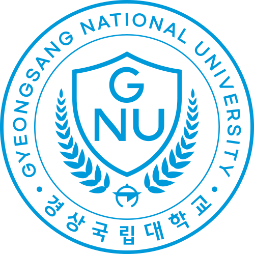
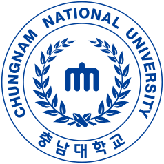
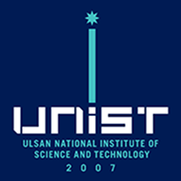

<h1>Choi Minseo</h1>

<a href="./README.md"><kbd>English</kbd></a>

  
  <strong>학생 / 경상국립대학교 (2026. 03. 03. - )</strong> 
  경상국립대학교 수의과대학 수의예과 
  52828 경상남도 진주시 진주대로 501 
  <a href="https://gnu.ac.kr/"><kbd>🔗 경상국립대학교</kbd></a>
  <a href="https://vet.gnu.ac.kr/"><kbd>🔗 수의과대학</kbd></a>

 

  
  <strong>학생, 연구자 / 충남대학교 (2024. 03. 04. - 2026. 02. 20.)</strong> 
  충남대학교 자연과학대학 화학과 
  34134 대전광역시 유성구 대학로 99 
  <a href="https://plus.cnu.ac.kr/"><kbd>🔗 충남대학교</kbd></a>
  <a href="https://cns.cnu.ac.kr/"><kbd>🔗 자연과학대학</kbd></a>
  <a href="https://chem.cnu.ac.kr/"><kbd>🔗 화학과</kbd></a>

 

<a
  id="cy-effective-orcid-url"
  class="underline"
  href="https://orcid.org/0009-0001-1744-4586"
  target="orcid.widget"
  rel="me noopener noreferrer"
  style="vertical-align: top">
  
  https://orcid.org/0009-0001-1744-4586
</a>

 

<h3>학문 분야</h3>

<kbd>응용과학</kbd> 수의학 — 감염의학, 바이러스학 및 전염병학 
<kbd>기초과학</kbd> 미생물학 · 생화학 · 화학

<h3>관심 분야</h3>

데이터 과학 · 화학정보학 · 생물정보학

<h3>연락처</h3>

  
  <strong>개인</strong>
   
  <a href="mailto:minseo0388@daum.net">minseo0388@daum.net</a>
   
  개인 연락용

  
  <strong>경상국립대학교</strong> 
  <a href="mailto:minseo0388@gnu.ac.kr">minseo0388@gnu.ac.kr</a>

 

  
  <strong>충남대학교</strong> <kbd>Expired</kbd> 
  <a href="mailto:minseo0388@o.cnu.ac.kr">minseo0388@o.cnu.ac.kr</a>
  &nbsp;·&nbsp;
  <a href="mailto:minseo0388@g.cnu.ac.kr">minseo0388@g.cnu.ac.kr</a>
   
  (2026.05.22까지 유효함) · (2026.05.01까지 유효함)

  
  <strong>UNIST</strong> 
  <a href="mailto:minseo0388@unist.ac.kr">minseo0388@unist.ac.kr</a>
   
  (등록 후 생성된 계정으로, 2026. 02. 28. 자퇴 후에도 현재 사용 가능하며 말소 시점은 미정입니다.)

 

  
  대한민국 부산광역시 동래구 
  35°12'15.9"N 129°04'40.9"E 
  <i>매 순간 마주하는 흐름이 하나가 되어</i> 
  <i>Ignition of fully integrated life</i>

 

대학·지방자치단체 로고와 엠블럼의 권리는 각 기관에 있으며, 이 프로필에서는 소속과 지역을 나타내는 용도로만 사용했습니다.
